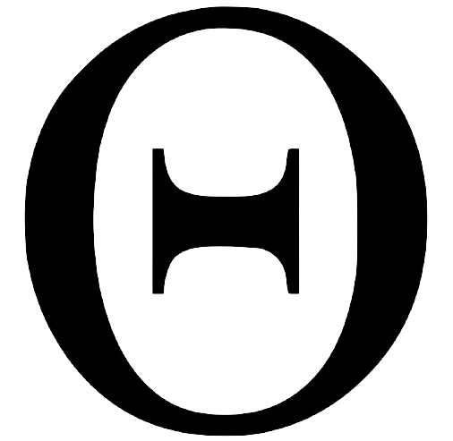

<h1 align="center">Theta</h1>

  

        

Theta is a simple, Java swing-based library that abstracts the complexities and intricacies that go into not only game development, but also graphical user interface development. This is a successor to my Java Standards library.
